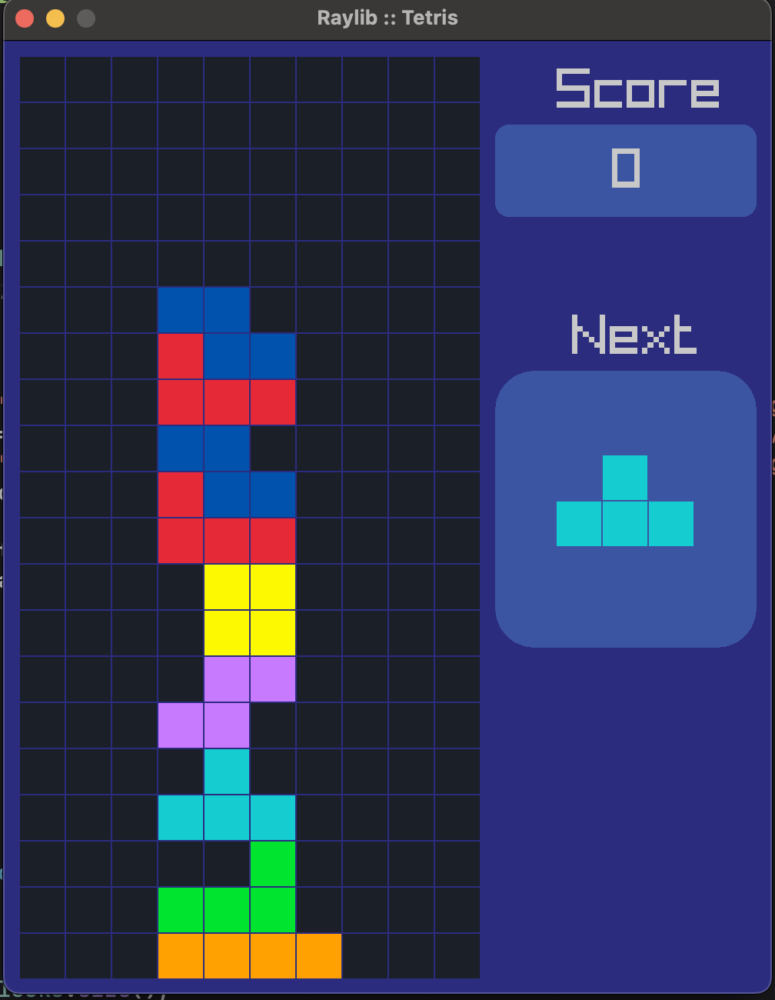
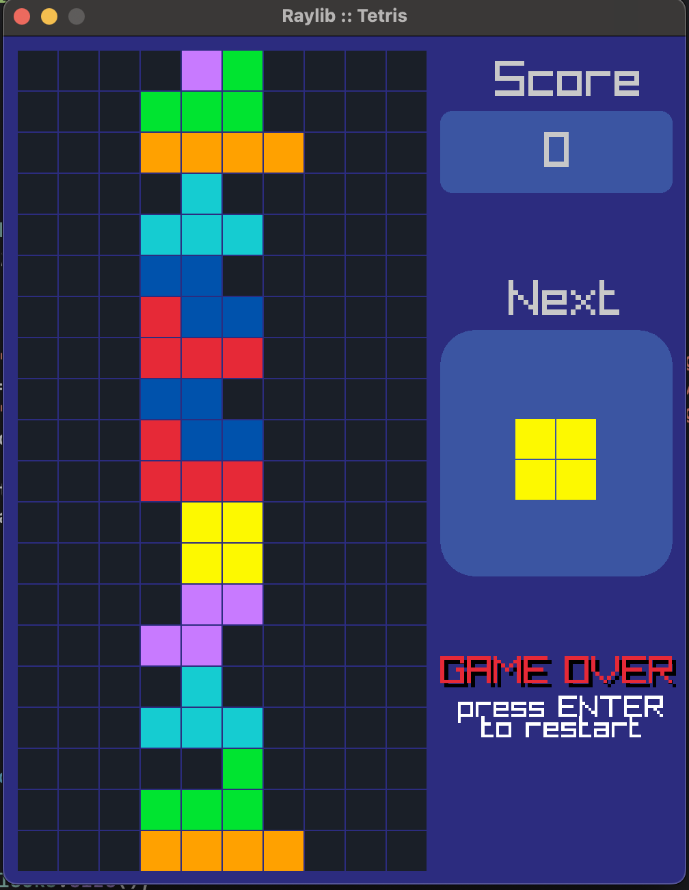

# Tetris Game using Raylib

A classic Tetris game implementation using the Raylib game development library and Object-Oriented Programming (OOP) principles in C++.







## Features

- Tetris game with falling blocks, scoring, and end-game conditions.
- Implement using Raylib, a simple yet powerful game development library.
- Organize code with Object-Oriented Programming (OOP) for better structure.
- Provide options for customizing game settings like block speed and scoring.
- Maintain a clean, modular codebase for easier updates and expansions.

## Controls

- Use the ***arrow keys*** to move the blocks left and right
- Use the ***down arrow key*** to move the blocks down faster
- Use the ***up arrow key*** to rotate the blocks
- Press the ***Enter key*** to restart the game after game over
## Requirements

- Raylib library (version 4.0 or later)
- C++ compiler (e.g., GCC)
## Building and Running

- **Clone the repository**: 
```
git clone https://github.com/Amie2002/Tetris-Game-using-Raylib.git
```
- **Navigate to the project directory**: 
```
cd Tetris-Game-using-Raylib
```
- **Build the project**: Using your preferred C++ compiler, e.g., 
```
g++ -o tetris main.cpp -lraylib
```
- **Run the game**: 
```
./tetris
```

Note: Make sure you have Raylib installed and configured on your system before building and running the game.
## Note
- This project is a work in progress, and you may encounter bugs or issues. Please report any issues you find, and I'll do my best to fix them.
- Contributions are welcome! If you'd like to add new features, fix bugs, or improve the codebase, please submit a pull request.
## Reference

- [@educ8s](https://github.com/educ8s)


## Acknowledgements

 - Raylib library: https://www.raylib.com/

Feel free to modify and improve the game! If you have any questions or issues, please open an issue on this repository.


